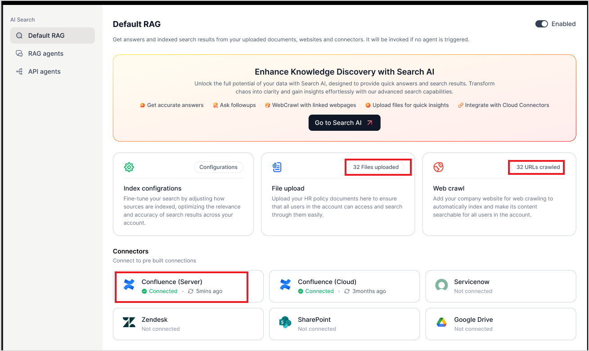
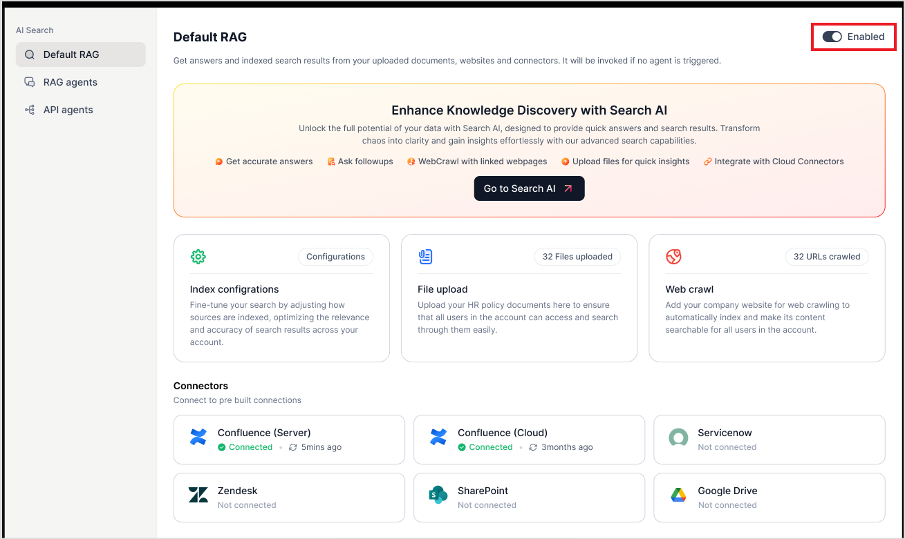

# Enterprise Knowledge

The **Enterprise Knowledge** refers to a pre-configured **Retrieval-Augmented
Generation** (RAG) based **Search AI** app that is provisioned for every AI for Work account. It serves as a fallback mechanism, ensuring a response can still be generated when no specific agents align with the user’s intent. Its role is to enhance the accuracy and relevance of responses by retrieving content from
various sources and then generating a response based on that information. It is automatically available to users when no custom or specific agents are assigned to handle a user query.

Unlike other specialized RAG agents that may be configured for specific tasks or intents, the **Enterprise Knowledge** provides generalized search and response capabilities, making it a handle for fallback queries. No specific intent or purpose is associated with the Enterprise Knowledge.

## Key Features

-   **Fallback Mechanism**: It activates when no specific RAG agent matches the
    user’s query, ensuring the system can still provide useful responses.

-   **Multiple Data Sources**: It retrieves information from various sources,
    including webpages, local files, third-party knowledge systems, and
    structured data.

-   Generates response from retrieved information.

## How Does Enterprise Knowledge Work?

The **Enterprise Knowledge** is meant for generic use rather than a specific intent.

-   When a user asks a question, the system first checks if any specific agent (a
    customized or specialized retrieval model) is relevant to handle that query.

-   If no specific agent is found for the query, the Enterprise Knowledge is activated.

-   The Enterprise Knowledge searches through its configured content sources and
    retrieves the most relevant information related to the query.

-   Once the relevant content is retrieved, a coherent and contextual response
    is generated. This response is presented to the user as the search result.

## Enterprise Knowledge Configuration

### Connect Search AI

1. Navigate to **Enterprise Knowledge** on the left pane.
2. Click **Connect Search AI**.

3. The next step is to configure the Search AI app, which has the indexed content used for answer generation. Provide the following details for the connection.
    - **App ID**: Application ID of the Search AI app.
    - **Client ID**: Client credentials generated in Search AI for interaction with the RAG Agent.
    - **Client Secret ID**: A secret key generated for secure interaction.
    - **Search ID**: Unique identifier of the client generated in Search AI.
    

!!! note

    These details are available in the **Search AI app** on the **Credentials** page under the **Manage** tab. Refer to [this](https://docs.kore.ai/xo/searchai/about-search-ai/){:target="_blank"} for more details.

### Access associated Apps

Under the **AI search** agents, go to **Enterprise Knowledge**. Then, use the **Go to
Search AI** option to access **the associated Search AI** app.

-   [Configure the content sources](https://docs.kore.ai/searchassist/manage-content-sources/content-overview/){:target="_blank"} on the Search AI application.

-   Fine-tune configurations to get appropriate responses.

-   [Enable Answers](https://docs.kore.ai/searchassist/concepts/personalizing-results/about-answers/){:target="_blank"}.

-   Train the application.

On the following page in the Admin Console, you can view an overview
of the content sources connected to the Enterprise Knowledge, such as uploaded files,
indexed webpages, third-party content sources, etc. Each source's associated
content or connection status is also indicated. For the third-party connectors,
it also indicates the last sync time.

## Enabling/Disabling Enterprise Knowledge

Enterprise Knowledge can be enabled using the toggle button on the top right.

