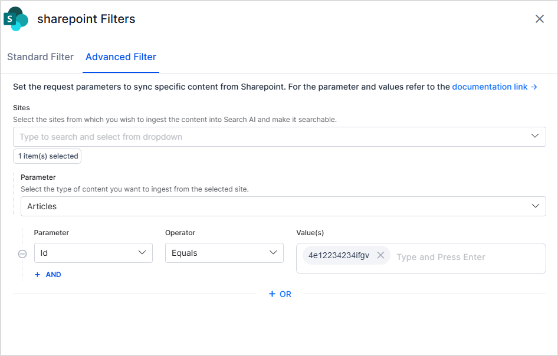
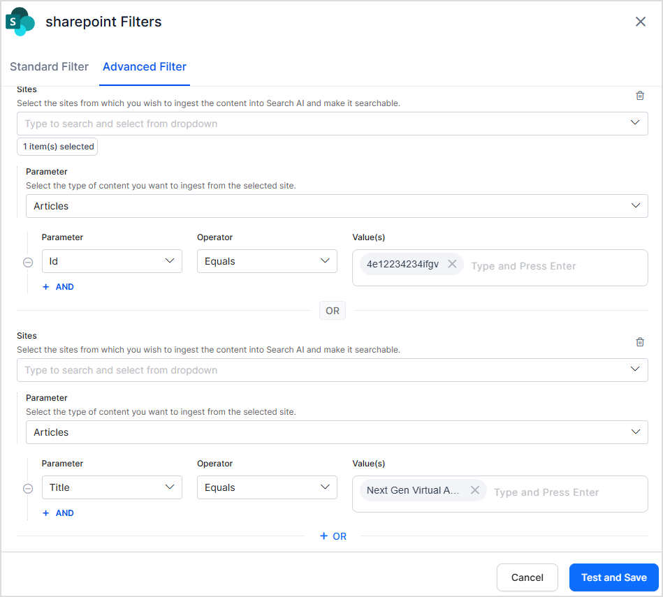
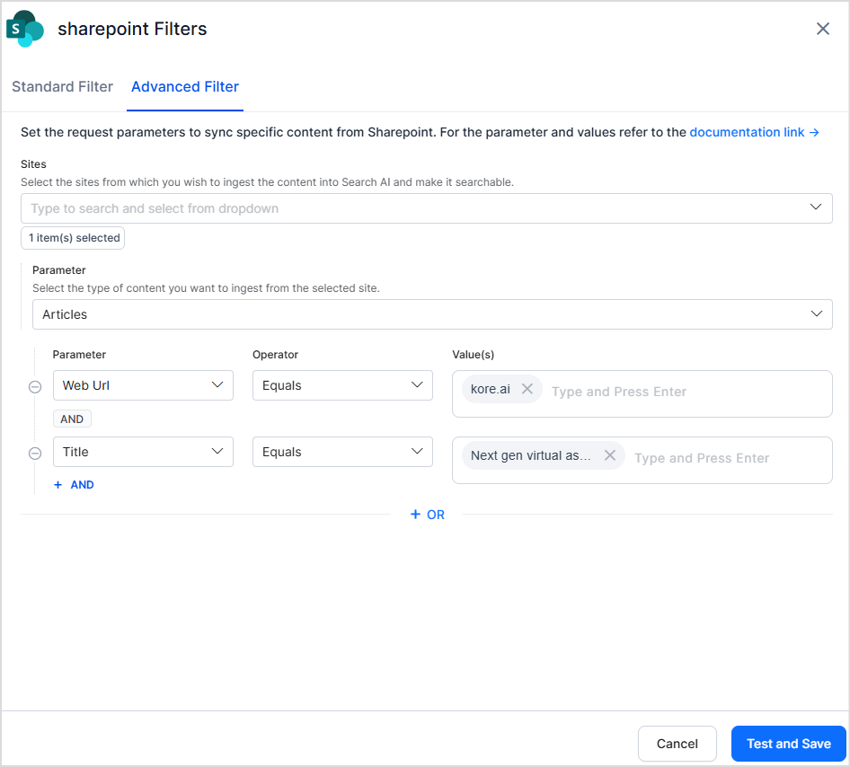

# SharePoint Connector

Configure the SharePoint connector if you're using SharePoint to manage your content and want to make your existing content searchable with SearchAI. Configuring SharePoint as a content source requires:

* **Registering a multi-tenant app in SharePoint**
* **Configuration of the SharePoint connector in SearchAssist**

## Authorization Support

Search AI supports **OAuth 2.0 Authorization Code Grant Type** mechanism for SharePoint.

## Registering multi-tenant app in SharePoint

App registrations are required to access resources programmatically. Registering an application establishes trust between the SearchAI application and the identity provider, the Microsoft identity platform. To register, 

* Log in to the [Azure Platform Portal](https://portal.azure.com/#home) and go to Manage **Azure Active Directory**.

* Register a new application. To do so, go to **App Registrations** under **Applications** and click on **New Registration.**

* Enter the application's name. Create a multi-tenant account and set the account type to ‘Accounts in any organization directory’. Set the Redirect URL and click **_Register_**. You can use one of the following URLs according to your region.
    * JP Region Callback URL: https://jp-bots-idp.kore.ai/workflows/callback
    * DE Region Callback URL: https://de-bots-idp.kore.ai/workflows/callback
    * Prod Region Callback URL: https://idp.kore.com/workflows/callback
    

* This will generate a client ID, which will be used to identify the application uniquely in the  Microsoft Identity Platform. Save the **ClientId** and **TenantId** from the **Overview** section.

* Next, [Generate a client Secret for the registered app](https://learn.microsoft.com/en-us/azure/active-directory/develop/quickstart-register-app#add-a-client-secret) under the **Certificates and Secrets** tab.

* Enter a description and set the expiration time to 24 months. Click **Add**.

 

* Save the client secret generated. The client secret cannot be seen again on switching the tabs. 

* The next step is to set up the application's required permissions. Go to **API Permissions** and click **Add a permission**.

* Add the following delegated permissions found under **Microsoft Graph**.
    * User.ReadBasic.All
    * Group.Read.All
    * Directory.AccessAsUser.All
    * Files.Read
    * Files.Read.All
    * Sites.Read.All
    * Offline_access
    
    

* After adding all the permissions, click **_Grant Admin Consent_** to grant the permissions to the application.

* To configure the SharePoint connector in SearchAssist, use the client ID, client secret, and tenant ID generated above. For more details, refer to [this](https://learn.microsoft.com/en-us/azure/active-directory/develop/quickstart-register-app).

## Configuration of the SharePoint connector 

Go to the **Connectors** under **Sources** and select **SharePoint**. On the Authorization page, enter the **Client ID**, **Tenant ID**, and **Client Secret** generated during the application registration in the Azure portal. Choose the desired content type—**All, Articles,** or **Files**. Assign a name for the connector, then click **Connect**.

This will authenticate with the SharePoint application. Once the authorization process is complete and the connector is configured, the next step is to select the SharePoint sites from which you want to ingest the content and make it searchable. Go to the **Configure** section, click the **Select Content** link, select the sites from which you want to ingest content, and click **Save**. Click on **Sync Now** to start content ingestion. 

## Advanced Content Filtering

In addition to choosing one or more sites for content ingestion, Search AI provides the flexibility to selectively ingest content by allowing you to apply custom filtering rules. These rules help control which content is ingested, improving relevance and efficiency. To do this, navigate to the **Advanced Filter** tab. Here, you can define your filtering rules using the fields provided.

* **Site**: Select the site on which filtering is to be done. 
* **Content-Type**: Select the type of content from the site, such as articles or files.  

Use the following fields to set up conditions for the filtering rules. 

* **Parameter**: This is the attribute of the content on which the filter condition will be applied. Commonly used parameters are listed in the dropdown menu. You can also add other parameters by selecting the **+Add** option. Ensure that the parameters match exactly with the field names in SharePoint.
* **Operator**: Select an operator to define the condition on the chosen parameter (e.g., Equals, Contains, Greater Than).
* **Value**: Enter the value that the parameter should meet according to the chosen operator.

For instance, to selectively ingest articles with a given ID and from a specific SharePoint site, set up a filter as shown below. 

Note: 

* You can define one or more rules to create a filter. Content that satisfies any one of the rules in the filter is selected for ingestion. For instance, the following filter can be used to select articles where either the article has a specific ID or a specific title. 

* Every rule can have one or more conditions. The conditions in a rule are linked with a logical AND, which suggests that specific content is selected for ingestion when all the conditions in the rule are satisfied.  For instance, the following filter can be used to select articles with a given title and web URL. 

## Access Control

### Understanding Permissions in SharePoint

Permissions to files and pages in SharePoint include **site-level permissions** and **individual permissions** to the files. 

### Site-level Permissions

There are **two membership groups** in SharePoint: **Office 365** ** groups and **SharePoint Security groups**. These groups grant different access to your site. Users using both groups receive access permissions.

You can view the **Office 365 Group Membership** for a site here. 

Click on the **Members** button to view the list of members and their roles. 

Another set of permissions allows users to access a site. Go to **settings** and click on **site permissions**. These are referred to as **SharePoint Security Groups.**

Every site has three default SharePoint permission levels, which differ in the access granted to the users. 

* Site visitors 
* Site members 
* Site owners

### Handling of Site Permissions in SearchAI

Corresponding to the **Office 365 Group Membership group, a permission entity** is created in the SearchAI application. **All the users added to this group are automatically added to this permission entity in SearchAI. However, if there are email groups added here, the members of the group should be added to the permission entity manually using the Permission Entity APIs.**

Similarly, corresponding to the **SharePoint Security Groups, three permission entities** are created in the SearchAI application. The users in these groups should be manually added to the corresponding permission entities using the Permission Entity APIs.  

Therefore, in the sourceACL field, you will see four permission entities corresponding to the site permissions. 

### File-level Permissions

The access control set for a site applies to all the files/pages within the site. Additionally, an owner of the file can share it with a new user, internally or externally. 

The owner can also share a file with all the domain or organization members. 

### Handling of File Permissions in SearchAI

* When a file is shared with a specific user, the user is automatically added to the sourceACL field of the corresponding files during ingestion. 
* When a file is shared with a user group, the groupId is used to create a permission entity that can be used to resolve individual users. 
* When a file is shared with a specific domain, the domain name is stored as a permission entity in the sourceACL field. SearchAI automatically compares the user email IDs with the domain name during answer generation. If there is a match, access to the files is granted.  